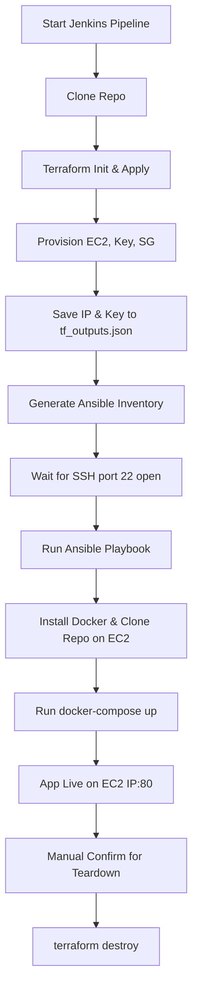

## 📦 Django-Todo-CICD

A simple, production-ready **Django Todo App** deployed with a full CI/CD pipeline using **Jenkins**, **Terraform**, **Ansible**, **Docker Compose**, and **AWS EC2** — all in one click.

> Add tasks, mark them complete, or delete them — but more importantly, **deploy this app without touching a terminal manually.** This project automates provisioning, deployment, and teardown of the entire stack.

---

### 🚀 Project Features

* ✅ Django-based Todo Web Application
* 🐳 Containerized with **Docker Compose**
* 🧩 Three-tier architecture: **Django + MySQL + Nginx**
* ⚙️ CI/CD using **Jenkins Pipeline**
* 🌩️ Infrastructure as Code with **Terraform (AWS EC2)**
* 🔐 Remote provisioning using **Ansible**
* 🔄 Automatic infra teardown with confirmation prompt
* 🧪 Fully automated from repo clone to live app

---

## 🗂️ Directory Structure

```bash
django-todo-cicd/
├── ansible/                # Ansible playbooks and inventory
├── terraform/              # Terraform files (main.tf, variables.tf, etc.)
├── Jenkinsfile             # CI/CD pipeline steps
├── docker-compose.yml      # Docker Compose config
├── .env                    # Environment variables for containers
├── manage.py               # Django entry point
└── ...                     # Django project files
```

---

## 🛠️ Tech Stack

| Layer       | Tool                  |
| ----------- | --------------------- |
| Web App     | Django (Python)       |
| Web Server  | Nginx                 |
| Database    | MySQL                 |
| CI/CD       | Jenkins + Jenkinsfile |
| Provision   | Terraform (AWS EC2)   |
| Config Mgmt | Ansible               |
| Container   | Docker Compose        |
| Infra       | AWS (EC2 only)        |

---

## ⚙️ How It Works

1. **Trigger Jenkins** by pointing it to the repo.
2. **Jenkinsfile** performs the following:

   * Clones the repo
   * Executes `terraform apply` to:

     * Provision an EC2 instance
     * Create key pair and security group
     * Save outputs (IP + key)
   * Waits for the instance (port 22) to become ready
   * Generates Ansible inventory from `terraform output`
   * Runs **Ansible Playbook** to:

     * SSH into EC2
     * Install Docker & Docker Compose
     * Clone the repo
     * Run the app using `docker-compose up`
3. **App is live** at the EC2’s public IP on port 80
4. Pipeline prompts to confirm **infra destruction**
5. If confirmed, it runs `terraform destroy`

---

## 🚧 Prerequisites

> These tools must be pre-installed **on the Jenkins host machine**.

* Jenkins
* Terraform
* Ansible
* Docker & Docker Compose
* AWS IAM credentials stored in Jenkins credentials store

---

## 🧩 Required Jenkins Plugins

Make sure the following plugins are installed on your Jenkins instance:

- [x] Pipeline
- [x] Pipeline: AWS Steps
- [x] Pipeline: Input Step
- [x] Git Plugin
- [x] Docker Pipeline
- [x] AWS Credentials
- [x] Credentials
- [x] Credentials Binding
- [x] SSH Credentials
- [x] Timestamper
- [x] Workspace Cleanup

> ✅ Tip: Go to `Manage Jenkins → Plugin Manager → Installed` to verify.

---

## 📝 Setup Instructions

### 1. Clone the Repo

```bash
git clone https://github.com/amitkumar0128/django-todo-cicd.git
cd django-todo-cicd
```

### 2. Configure Jenkins

* Set up a Jenkins pipeline project
* In the pipeline config, point to the `Jenkinsfile` in this repo
* Add your AWS credentials in Jenkins:

  * Go to **Manage Jenkins > Credentials**
  * Add **AWS Access Key ID** and **Secret** (ID: `AWS_CREDENTIALS_ID` if used in pipeline)

### 3. Trigger the Build

* Run the pipeline
* Watch automation magic happen 😎

---

## 📌 CI/CD Flow Summary



---

## 🧪 Testing the App

Once deployed, visit:

```
http://<EC2_PUBLIC_IP>
```

* Add a new task
* Mark as completed
* Delete tasks

---

## 🧼 To-Do

* [ ] Add CI badges
* [ ] Enable HTTPS with Let's Encrypt
* [ ] Add monitoring via Prometheus & Grafana
* [ ] Auto-scale infra using ASG (future)

---

## 🤝 Contributing

Contributions are welcome!
Feel free to submit pull requests or open issues.

---

## 📄 License

[MIT License](LICENSE)

---

## 🙋‍♂️ Author

**Amit Kumar**
🔗 [GitHub](https://github.com/amitkumar0128)

---
